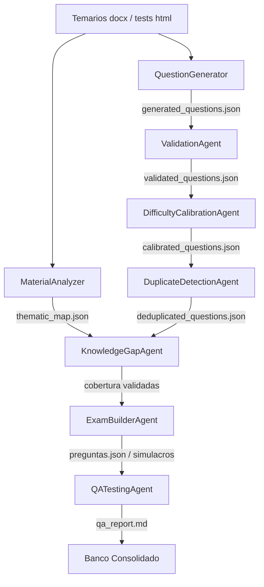

# Plan de Desarrollo del Agente: Test de Curso de Cabo 1.º PWA y Pipeline Multiagente

Este documento detalla la arquitectura de la aplicación, el proceso de mantenimiento de datos mediante agentes inteligentes y la estrategia de desarrollo del proyecto.

## 1. Objetivo Principal (Mission Statement)

Crear una Progressive Web App (PWA) robusta, intuitiva y autogestionada para ayudar a los alumnos a prepararse para el **Curso de Actualización para Cabo 1.º del Ejército del Aire y del Espacio**. La aplicación debe funcionar offline, persistir el progreso de forma aislada, y nutrirse de un banco de preguntas dinámico, calibrado, libre de duplicados y estructurado formalmente por temas a partir del material oficial, gestionado a través de un pipeline multiagente.

---

## 2. Arquitectura de la Aplicación (Frontend)

La interfaz y la lógica cliente están estructuradas de forma modular en JavaScript (ES6+), HTML y CSS tradicional, garantizando compatibilidad y carga rápida.

### Modos de Práctica
*   **Test Normal Configurable**: Muestreo dinámico y estratificado proporcional según el volumen de preguntas no vistas por cada uno de los temas.
*   **Repaso de Fallos**: Sesión interactiva con preguntas marcadas como incorrectas por el usuario, con persistencia.
*   **Test por Temas**: Práctica enfocada e independiente en cada uno de los 12 temas oficiales.
*   **Simulacros de Examen**: Tres simulacros estáticos de 30 preguntas con calificación formal APTO/NO APTO (nota de aprobado >= 50/100, donde cada fallo resta 0.33).

### Componentes de Software Frente
*   `index.html`: Estructura semántica de vistas de menú, temas, test interactivo, modales de confirmación y banners de actualización.
*   `style.css`: Sistema de diseño moderno con soporte nativo de modo oscuro (clase `.dark-mode`), variables CSS personalizadas y diseño responsive móvil/escritorio.
*   `app.js`: Punto de entrada de la aplicación, encargado de controlar el flujo de navegación, temporizaciones de avance automático, restaurado de sesiones previas y registro del *Service Worker*.
*   `state.js`: Gestor del estado de la sesión activa del test, cálculo de puntuaciones y pasarela con la capa de persistencia.
*   `ui.js`: Encapsula los renderizados visuales, animaciones de transición (`fade-in`/`fade-out`/`shake`), sonido y vibración háptica.
*   `storage.js`: Capa de persistencia limpia que manipula `localStorage` con aislamiento de claves (`testCabo1State_*`).
*   `questionManager.js`: Carga asíncrona de los archivos JSON (`preguntas.json`, `simulacro_*.json`), deduplicación al vuelo para unificación y clasificación temática dinámica en el navegador.

---

## 3. Arquitectura del Pipeline de Datos (Backend Multiagente)

El banco de preguntas oficial se genera, valida, calibra y audita mediante un pipeline multiagente en Python y Node.js alojado en `/agents` y `.skills/`.

### Agentes del Pipeline (`agents/`):
1.  **Orquestador** (`orchestrator.py`): Controla la ejecución secuencial y las transferencias de estado del pipeline.
2.  **Analizador de Material** (`material_analyzer.py`): Extrae información y leyes de los documentos teóricos en `/nuevomaterial/Temario` para estructurar la cobertura del mapa temático (`thematic_map.json`).
3.  **Generador de Preguntas** (`question_generator.py` y `html_extractor.js`): Extrae preguntas desde exámenes HTML existentes y del archivo `AUTOEVALUACIÓN.docx`, integrando además las preguntas hechas a mano en `extra_questions.json`.
4.  **Validador de Estructura** (`validation.py`): Realiza pruebas de integridad sintáctica de las preguntas (comprobando que tengan exactamente 4 opciones, campos requeridos y que la respuesta esté entre las opciones).
5.  **Calibrador de Dificultad** (`difficulty_calibration.py`): Distribuye la complejidad de las preguntas según reglas de longitud y palabras clave complejas, cumpliendo con la cuota de **30% fácil, 50% media y 20% difícil**.
6.  **Detector de Duplicados** (`duplicate_detection.py`): Elimina de forma robusta duplicados exactos y semánticos (comparando la similitud del enunciado >0.65 y de la respuesta >0.75 o exacta).
7.  **Analizador de Lagunas** (`knowledge_gap.py`): Asegura que se cubra un mínimo de preguntas (3 para temas relevantes, 5 para críticos) cruzando los datos contra `thematic_map.json`.
8.  **Constructor de Exámenes** (`exam_builder.py`): Agrupa las preguntas en `preguntas.json` y construye los simulacros con conjuntos de preguntas balanceadas.
9.  **Control de Calidad** (`qa_testing.py`): Ejecuta comprobaciones sobre los entregables finales y emite el reporte de calidad `qa_report.md`.

---

## 4. Plan de Mantenimiento y Evolución

1.  **Añadir Nuevas Preguntas**: Se deben incorporar al fichero `agents/extra_questions.json` bajo la estructura JSON estándar y ejecutar `python agents/orchestrator.py` para regenerar y calibrar el banco de datos de forma segura.
2.  **Afinación de Calibración**: La lógica en `difficulty_calibration.py` puede ajustarse modificando las ponderaciones de longitud o términos específicos de leyes.
3.  **Detección de Colisiones**: La deduplicación del pipeline previene la inyección de preguntas similares asegurando que los simulacros y repasos sean limpios y diversos.